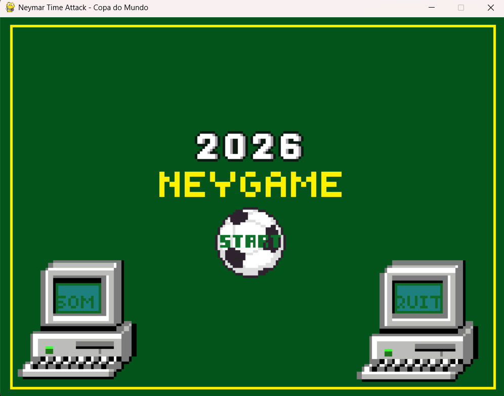
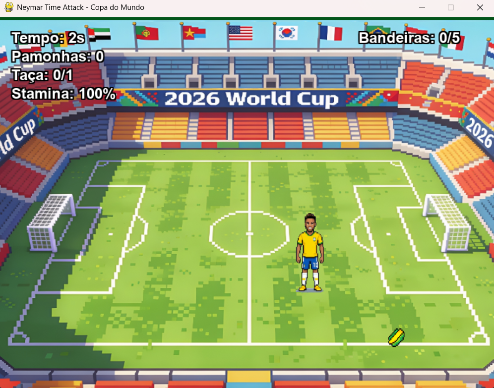
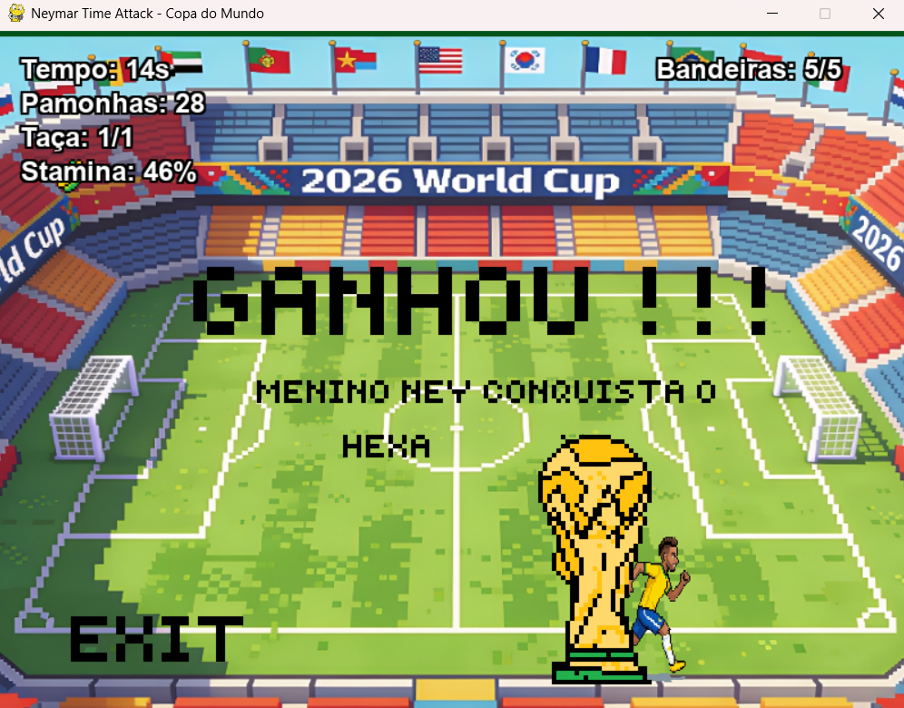
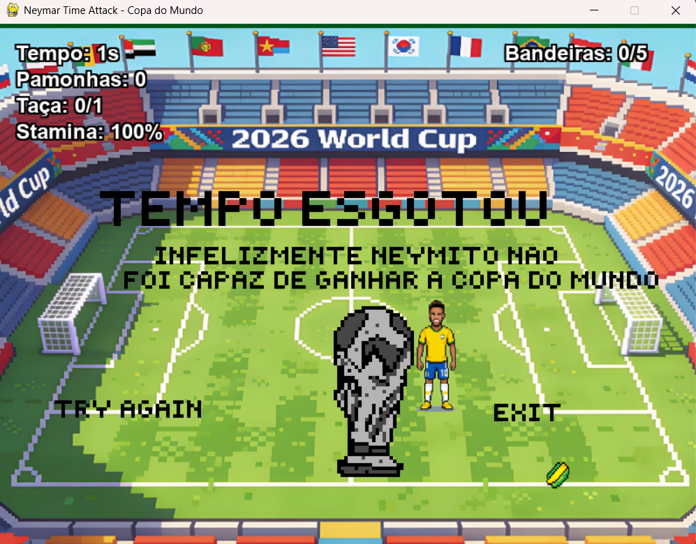

# Neymar Time Attack - Copa do Mundo 🏆⚽

Este projeto consiste em um jogo interativo 2D desenvolvido em Python utilizando a biblioteca Pygame. O objetivo principal do jogo é controlar o personagem principal (Neymar) em um campo de futebol para coletar itens temáticos gerados a partir de um procedimento na tela dentro de um limite de tempo, aplicando conceitos avançados de Programação Orientada a Objetos (POO) e Introdução à Programação.

---

## 👥 Integrantes da Equipe

* **Artur Regis de Souza**
* **Caio César Gomes de Souza França**
* **Gabriel dos Santos Bueno**
* **José Ricardo Veiga Monteiro Torres**
* **Mateus Henrique Crêspo de Carvalho**
* **Randell Almeida Julião de Lima**

---

## 📂 Arquitetura do Projeto

A estrutura de diretórios do projeto foi organizada de forma modular para facilitar o desenvolvimento em grupo e a aplicação de Orientação a Objetos:

```text
jOGOIP/
│
├── recursos/
│   ├── imagens/
│   ├── cenarios/
│   └── sons/
│
├── codigo/
│   ├── __init__.py
│   │
│   ├── classes/    
│   │   ├── __init__.py
│   │   ├── elemento_jogo.py
│   │   ├── jogador.py
│   │   └── itens.py     
│   │
│   └── utilitarios/
│       ├── __init__.py
│       └── configuracao.py
│
├── .gitignore
├── README.md
└── principal.py
```

---

## 🛠️ Tecnologias, Bibliotecas e Frameworks Utilizados

Para o desenvolvimento deste projeto, a equipe aplicou os conceitos de Orientação a Objetos (OO) para viabilizar a criação de um jogo 2D. As escolhas de tecnologias e suas respectivas justificativas estão detalhadas a seguir:

**Python (Linguagem Base):** Escolhida devido à sua curva de aprendizado acessível e suporte robusto a Orientação a Objetos. A estrutura da linguagem permitiu a criação de classes modularizadas (como `Jogador` e `ElementoJogo`) e a aplicação do conceito de herança de forma limpa, evidenciado na classe mãe `Item`, que transmite seus atributos e métodos para as subclasses `Pamonha`, `Bandeira` e `Taça`.

**Pygame (Biblioteca Principal):** O Pygame foi a principal biblioteca utilizada no desenvolvimento do jogo. Sua escolha se justifica pelos seguintes submódulos fundamentais para a nossa arquitetura:

- **`pygame.sprite`**: Utilizado para gerenciar entidades do jogo. A criação do `pygame.sprite.Group()` permitiu atualizar e renderizar múltiplos itens simultaneamente na tela com apenas um comando de update and draw.
- **Colisão Avançada (`pygame.mask` e `spritecollide`)**: Ao invés de usarmos apenas colisões retangulares (que são imprecisas), justificamos o uso do módulo de máscaras (`pygame.mask.from_surface`) na classe `Jogador`. Isso permitiu o recurso de *pixel-perfect collision*, garantindo que a interação entre o Neymar e os itens ocorresse apenas quando os pixels reais das imagens se tocassem.
- **`pygame.mixer`**: Empregado para o gerenciamento de áudio assíncrono. Foi crucial para a imersão do jogador, permitindo tocar a música de fundo em loop infinito e disparar efeitos sonoros específicos durante os eventos de gameplay (coleta de pamonha, spawn de bandeira, vitória e game over).
- **`pygame.time`**: Essencial para a mecânica principal do jogo. O controle de relógio (`Clock.tick(FPS)`) garantiu uma taxa de quadros estável independente do hardware, enquanto o `pygame.time.get_ticks()` foi utilizado para calcular a regressão do cronômetro, a regeneração gradual da stamina do jogador e a exibição temporizada dos alertas de texto na tela.

**Bibliotecas Nativas do Python (`sys` e `random`):** Para otimizar o código, módulos nativos foram importados:

- **`random`**: Justifica-se pela necessidade de fator surpresa. O método `randint` foi utilizado na classe `Item` para sortear as coordenadas X e Y de surgimento dos itens de forma metódica, sempre respeitando as margens e a resolução da tela.
- **`sys`**: Utilizado o método `exit()` para garantir o encerramento completo e seguro do processo do jogo na memória quando o usuário decide fechar a janela.

**Controle de Versão e Colaboração (Git e GitHub):** Para o trabalho em equipe, a escolha da tríade Git, GitHub e a IDE Visual Studio Code (VS Code) foi indispensável. Essa combinação se justificou pela segurança em codificar novas lógicas de forma isolada (utilizando o sistema de branches). A plataforma GitHub centralizou a união do código através de Pull Requests, evitando que conflitos entre as implementações individuais (arte, gameplay e lógicas de itens) quebrassem a versão estável e principal do jogo (`main`).

**Gerenciamento de Tarefas e Comunicação (Notion e Discord):**

- **Notion**: Utilizado como a plataforma principal de gerenciamento de tarefas e documentação. Nos permitiu dividir as responsabilidades, mapear os requisitos do jogo e acompanhar em tempo real o status de cada task (A Fazer, Em Progresso, Concluído), garantindo entregas dentro do cronograma pretendido.
- **Discord**: Adotado como o ambiente oficial de comunicação da equipe. Foi fundamental não apenas para as trocas de mensagens no dia a dia, mas principalmente pelas funcionalidades de ligação e compartilhamento de tela. Esses recursos agilizaram a resolução de problemas em conjunto, facilitaram sessões de programação em pares e tornaram as revisões de código muito mais dinâmicas antes de unirmos as partes do projeto.

---

## 🧠 Conceitos da Disciplina Utilizados no Projeto

A seguir, detalhamos como cada estrutura teórica e pilar de IP/POO foi implementada para construir a lógica, o fluxo e a interface do sistema no código-fonte:

| Conceito | Aplicação no Projeto |
|---|---|
| **Herança** | Aplicada na classe mãe `ElementoJogo` (que herda de `pygame.sprite.Sprite`), transmitindo construtores padrões, atributos de imagem (`image`, `rect`) e posicionamento para as classes filhas `Jogador` e `Item`. |
| **Polimorfismo** | Demonstrado nas subclasses de `Item` (`Pamonha`, `Bandeira` e `Taça`), onde cada tipo de item modifica e estende atributos específicos de pontuação, tempo concedido e comportamento lógico, mantendo a assinatura base herdada da classe mãe. |
| **Laço de Repetição Condicional (`while`)** | Usado para criar o Game Loop (Loop Principal). No arquivo `principal.py`, a estrutura `while True:` é responsável por manter o jogo rodando infinitamente, atualizando a tela e verificando eventos a cada frame até que o jogador decida fechar a janela. |
| **Laço de Repetição Iterativo (`for`)** | Usado para varrer coleções de dados temporárias. Utilizado no `principal.py` em duas frentes vitais: para ler as interações do teclado/mouse do usuário (`for event in pygame.event.get():`) e para processar todos os itens que colidiram com o jogador em um exato momento (`for item in itens_coletados:`). |
| **Estruturas Condicionais (`if`, `elif`, `else`)** | Uso no controle de fluxo, limites físicos e regras de negócio do jogo. É o conceito mais utilizado. No `principal.py`, gerencia as telas do jogo (ex: `if estado_atual == ESTADO_MENU:`). No `jogador.py`, os `if`/`elif` controlam a movimentação diagonal e impedem que o jogador saia da tela (`if x > 750: x = 750`). Também gerencia os gatilhos matemáticos de pontuação (ex: `elif pamonhas_coletadas == 10:` para liberar a Alemanha). |
| **Tuplas (`tuple`)** | Uso para armazenar dados imutáveis agrupados, especialmente coordenadas e cores. Presente na definição das cores RGB da classe `Pamonha` `(255, 215, 0)`, no retorno das novas coordenadas `(x, y)` ao final da função de andar do jogador, e na passagem de dimensões para a tela do Pygame (`LARGURA_TELA`, `ALTURA_TELA`). |
| **Listas (`list`)** | Uso para agrupamento de itens dinâmicos e verificação múltipla. A própria função de colisão do Pygame (`spritecollide`) retorna uma lista contendo os itens tocados. Além disso, utilizamos listas para simplificar verificações de estado condicional, como no trecho `if estado_atual in [ESTADO_GAME_OVER, ESTADO_VITORIA]`, que checa se o estado atual está contido na lista de telas finais. |
| **Dicionários (`dict`)** | Uso para mapeamento de chaves e valores para organização de recursos. Visível no `principal.py` durante o carregamento de sons e fontes, onde utilizamos a variável importada `ASSETS`. Estruturas como `ASSETS["SONS"]["COLETA_PAMONHA"]` mostram o uso de dicionários para buscar o caminho correto dos arquivos de forma organizada. |
| **Funções e Métodos (`def`)** | Uso na modularização do código, evitando repetição e facilitando a manutenção. Aplicado tanto no paradigma orientado a objetos (como os métodos `def stamina_regen()` e `def correr()` dentro da classe `Jogador`), quanto de forma metódica, como a função `def resetar_jogo():` no `principal.py`, que encapsula toda a rotina de zerar variáveis, esvaziar grupos e reposicionar o Neymar para reiniciar a partida de forma limpa. |

---

## 📅 Divisão de Trabalho
 
O projeto foi conduzido ao longo de 4 semanas, com responsabilidades organizadas por função dentro da equipe. A seguir, uma síntese do papel de cada integrante no desenvolvimento:
 
**Caio César — Arquiteto:** Responsável pela fundação técnica do projeto: estruturação do Game Loop principal (`principal.py`), definição das configurações globais (`configuracao.py`) e criação da classe base `ElementoJogo`, que serve de alicerce para toda a herança do sistema. Ao longo do desenvolvimento, também liderou a lógica do cronômetro regressivo e o gerenciador de estados/telas (Menu, Game Over, Vitória). Atuou como responsável central pelo versionamento no GitHub, aprovando Pull Requests e resolvendo conflitos de integração entre as partes do código, além de redigir a documentação técnica final (README.md).
 
**Mateus Henrique — Jogador:** Responsável pela implementação completa do personagem principal (Neymar), incluindo a classe `Jogador`, a movimentação via teclado, os limites físicos do campo, a mecânica de sprint ("Adulto Ney"), a animação de direção do sprite e o ajuste fino da hitbox por máscara de colisão. Também garantiu que o jogador respeitasse corretamente as transições entre telas (bloqueio no Menu/Game Over/Vitória e reset de posição ao reiniciar), além de contibuir na formulação dos slides.
 
**Artur Regis e José Ricardo — Coletáveis:** Responsáveis pela lógica dos itens do jogo: criação da classe base `Item` e do sistema de spawn metódico, além das subclasses `Pamonha`, `Bandeira` e `Taça`. Implementaram a detecção de colisão entre jogador e itens e o rastreamento individual de cada tipo coletado, viabilizando o placar detalhado do jogo, além de serem responsáveis pela padronização de comentários e por redigir a documentação técnica final (README.md), respectivamente.
 
**Randell Almeida e Gabriel Bueno — Design/UI:** Responsáveis pela identidade visual e sonora do projeto: captação e tratamento de sprites, cenários e efeitos sonoros, renderização da interface de placar e cronômetro, homologação visual dos assets e produção das telas finais (Menu, Vitória, Derrota) com trilha sonora em loop. Gabriel Bueno também desenvolveu a lógica de dificuldade progressiva do jogo.
 
**Tasks Coletivas:** Já a etapa de documentação e apresentação, capturas de tela, depoimentos, explicação dos pilares de POO e montagem dos slides, envolveu todos os 6 integrantes da equipe.
 
---

## 🚨 Desafios, Erros e Aprendizados

**O Maior Erro:** Durante o desenvolvimento, o maior erro cometido pelo grupo foi a falta de atualização e sincronização constante das branches locais responsáveis pela implementação do personagem e movimentação. Isso gerou severos conflitos de integração (*merge conflicts*) quando tentou-se unificar o código. A equipe lidou com a situação analisando detalhadamente como integrar o jogador de forma adaptada ao código que já estava construído, resolvendo problemas de indentação, condicionais equivocadas e trechos repetidos por meio de comunicação direta entre o responsável pelo jogador (Mateus) e o responsável pelo versionamento e GitHub (Caio).

**O Maior Desafio:** O maior desafio do projeto foi aprender a versionar o código em equipe utilizando o ecossistema Git/GitHub enquanto simultaneamente assimilava-se os pilares de Programação Orientada a Objetos e as lógicas das bibliotecas necessárias. Manter um workflow limpo e livre de quebras na ramificação estável foi a maior dificuldade da equipe. As adversidades foram superadas a partir da prática constante no dia a dia, comunicação aberta e intensiva entre os integrantes do grupo e estudo pesado dos conceitos teóricos necessários.

**Lições Aprendidas:**

- **Organização como Pilar Essencial:** A estruturação prévia do projeto, aliada a uma modularização limpa do código e uma boa divisão de diretórios, mitiga impactos de refatoração e facilita drasticamente o entendimento do software como um todo.
- **Clareza na Comunicação:** Uma comunicação ativa e clara entre os membros poupa tempo de retrabalho, alinha expectativas técnicas e confere uma produtividade e eficiência nitidamente maiores ao grupo.
- **Evolução Prática Real:** Aprender conceitos teóricos complexos (como POO e gerenciamento de memória) aplicando-os diretamente na prática e na resolução de problemas do mundo real gera uma curva de evolução acadêmica e profissional imensamente superior se comparada ao estudo puramente passivo e teórico.

## 📸 Demonstração

### Telas do Jogo

<p align="center">
  
  
  
  
</p>
